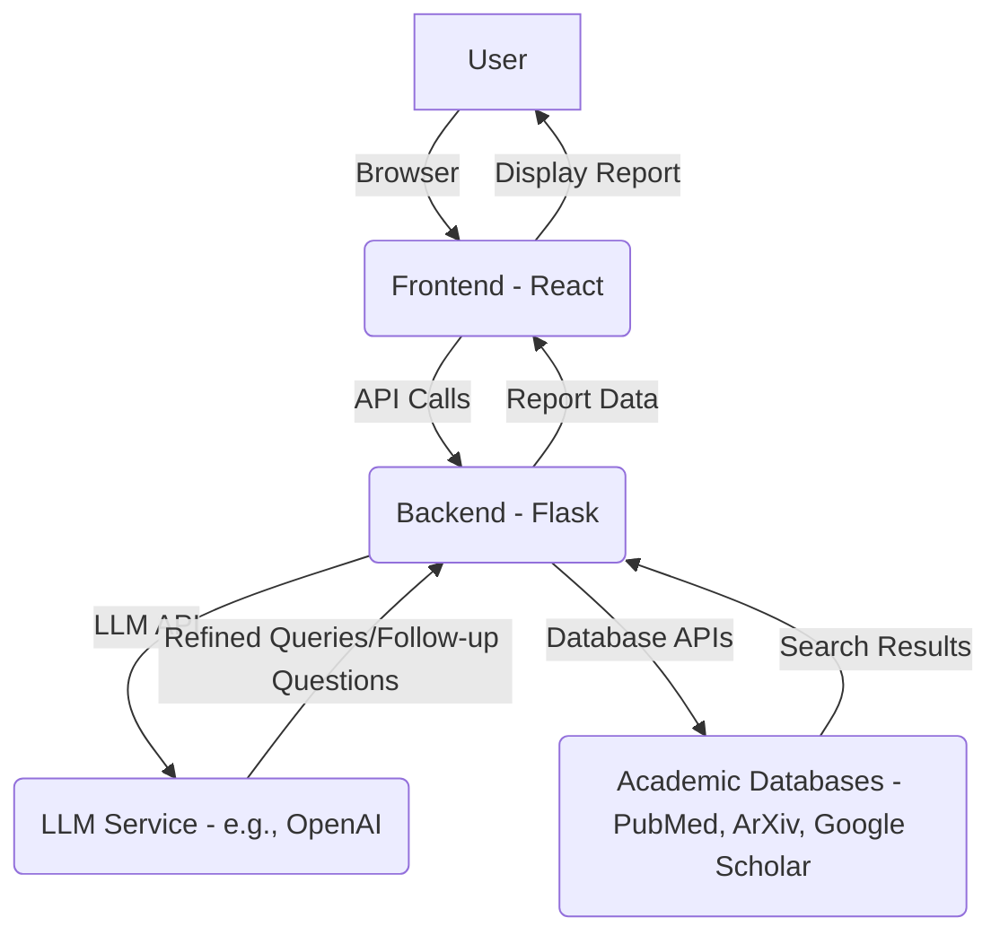

# Web Application Architecture Plan

This document outlines the proposed architecture and design for a web application similar to Undermind.ai, focusing on LLM-powered query refinement, similarity search across academic databases, and report generation with inline citations.

## 1. Overall Architecture

The application will follow a client-server architecture, consisting of a React-based frontend, a Flask-based backend, and integration with external academic databases. The LLM component will primarily reside within the backend, handling natural language processing tasks.

## 2. Frontend (React)

### 2.1. User Interface Components

*   **Search Bar:** An intuitive input field for users to enter their initial research queries.
*   **Query Refinement Interface:** A dynamic section where the LLM can ask follow-up questions and present refined query options to the user.
*   **Search Results Display:** A clear and organized display of search results from various academic databases, including titles, abstracts, authors, and publication details.
*   **Report Generation View:** A dedicated area to display the generated research report, with interactive elements for inline citations.
*   **Citation Management:** A mechanism to view and manage all cited sources.

### 2.2. Key Features

*   **Interactive Query Input:** Real-time suggestions and auto-completion for search queries.
*   **Dynamic Follow-up Questions:** Display LLM-generated follow-up questions to guide the user in refining their research intent.
*   **Multi-database Results Aggregation:** Present results from different databases in a unified and filterable view.
*   **Inline Citation Highlighting:** Allow users to click on inline citations in the report to view the corresponding source.
*   **Responsive Design:** Ensure optimal user experience across various devices (desktop, tablet, mobile).

## 3. Backend (Flask)

### 3.1. API Endpoints

*   `/api/search`: Handles initial search queries and returns aggregated results.
*   `/api/refine_query`: Manages LLM interaction for query refinement and follow-up questions.
*   `/api/generate_report`: Triggers the report generation process based on selected search results.
*   `/api/citation_details`: Provides details for a specific citation.

### 3.2. Core Modules

*   **LLM Integration Module:** Interfaces with the chosen LLM service (e.g., OpenAI API) to handle natural language understanding, query expansion, follow-up question generation, and summarization for report creation.
*   **Database Connector Module:** Contains logic for connecting to and querying various academic databases (PubMed, ArXiv, Google Scholar). This module will handle API keys, rate limiting, and data parsing specific to each database.
*   **Similarity Search Module:** Implements algorithms to perform similarity searches based on refined queries across the retrieved data from academic databases.
*   **Report Generation Module:** Compiles information from search results and LLM-generated insights into a structured report. This module will be responsible for formatting, adding inline citations, and potentially generating different report formats (e.g., PDF, Markdown).
*   **Citation Management Module:** Stores and manages citation information, linking them to the generated reports.

## 4. LLM Service Integration

*   The LLM will be used for:
    *   **Query Understanding and Expansion:** Interpreting user queries and expanding them with relevant keywords and concepts.
    *   **Follow-up Question Generation:** Crafting intelligent follow-up questions to clarify user intent and narrow down search scope.
    *   **Summarization:** Condensing research papers and articles into concise summaries for report generation.
    *   **Information Extraction:** Identifying key information and entities from search results for structured reporting.
    *   **Report Cohesion:** Ensuring the generated report flows logically and presents information coherently.

## 5. Database Integration Strategy

### 5.1. PubMed

*   **API:** Utilize the NCBI E-utilities API (e.g., ESearch, EFetch) for programmatic access to PubMed.
*   **Data Extraction:** Parse XML or JSON responses to extract relevant fields such as title, abstract, authors, publication date, and journal information.

### 5.2. ArXiv

*   **API:** Use the arXiv API for searching and retrieving preprints.
*   **Data Extraction:** Parse Atom XML feeds to extract similar metadata as PubMed.

### 5.3. Google Scholar

*   **API:** Direct API access to Google Scholar is limited. We will need to investigate third-party APIs or consider web scraping (with caution and adherence to terms of service) if direct API access is not feasible or sufficient. Alternatively, focus on PubMed and ArXiv initially and explore Google Scholar integration as a later enhancement.

### 5.4. Data Normalization

*   A crucial aspect will be normalizing data obtained from different databases into a consistent format for unified display and processing.

## 6. Data Flow

1.  User enters a query in the frontend.
2.  Frontend sends the query to the `/api/search` endpoint on the Flask backend.
3.  Backend's LLM Integration Module processes the query, potentially generating follow-up questions.
4.  Backend's Database Connector Module queries PubMed, ArXiv, and potentially Google Scholar.
5.  Search results are returned to the backend, normalized, and sent to the frontend.
6.  User refines the query based on follow-up questions or selects relevant results.
7.  Frontend sends selected results/refined query to `/api/generate_report`.
8.  Backend's Report Generation Module, using LLM for summarization and cohesion, creates the report.
9.  Report with inline citations is sent back to the frontend for display.

## 7. Future Enhancements

*   User authentication and personalized research dashboards.
*   Integration with additional academic databases.
*   Advanced filtering and sorting options for search results.
*   Exporting reports in various formats (e.g., PDF, DOCX).
*   Collaboration features for research teams.
*   Alerts for new relevant publications.

This plan provides a high-level overview. Detailed design documents for each module will be created in subsequent phases.

## 5.5. API Details and Access

### PubMed API

*   **Name:** NCBI E-utilities
*   **Description:** A suite of 8 server-side programs that provide a stable interface to all Entrez databases, including PubMed.
*   **Access:** Programmatic access via HTTP GET or POST requests. Key E-utilities include `ESearch` for searching and `EFetch` for retrieving full records.
*   **Documentation:** [https://www.ncbi.nlm.nih.gov/books/NBK25501/](https://www.ncbi.nlm.nih.gov/books/NBK25501/)

### ArXiv API

*   **Name:** arXiv API
*   **Description:** Provides programmatic access to arXiv's e-print content and metadata.
*   **Access:** Accessible via HTTP GET requests, returning results in Atom XML format. Does not require an API key.
*   **Documentation:** [https://info.arxiv.org/help/api/index.html](https://info.arxiv.org/help/api/index.html)

### Google Scholar API

*   **Name:** No Official Google Scholar API
*   **Description:** Google Scholar does not provide an official public API for direct programmatic access.
*   **Alternatives:** Third-party APIs (e.g., SerpApi, ScraperAPI, Scrapingdog) exist that scrape Google Scholar results. These often come with costs and usage limitations. Alternatively, web scraping can be considered, but it requires careful adherence to terms of service and ethical considerations, and is prone to breaking due to website changes. For initial development, we will prioritize PubMed and ArXiv integration and consider third-party Google Scholar APIs or more robust scraping solutions as a future enhancement if absolutely necessary.

